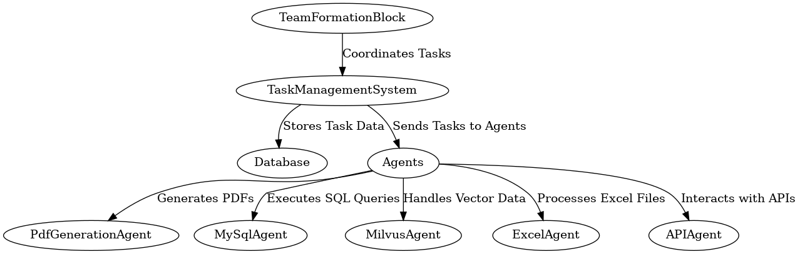
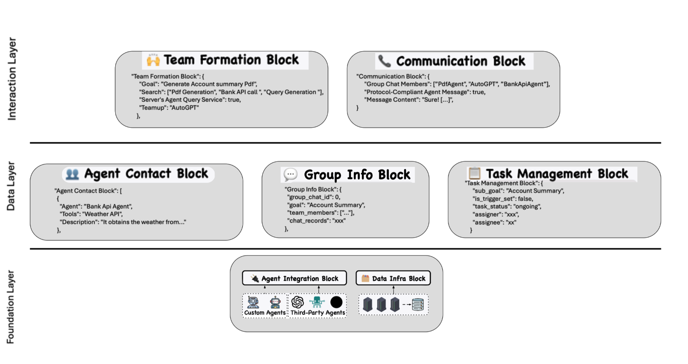

# Multi-Purpose AI Agent Framework

## A compendium of code, data, and author's manuscript accompanying the manuscript:

#### Multi-Purpose AI Agent Framework: A Versatile Approach for Agent-Orchestrated Collaboration

---

## Overview
This repository is structured as a **reproducible research compendium** for the **Multi-Purpose AI Agent Framework**.  
It includes the complete implementation techinques , Project Structure, and supporting materials.  
Future updates will feature **Dockerized execution** and a **Binder container** for easy deployment and reproducibility.

---

## File Organization

📂 Multi-Purpose-AI-Agent-Framework/
│
├── 📁 analysis/  
│   ├── 📁 logs/  
│   │   └── log.md           # Logs of progress, changes, and observations  
│   ├── 📁 images/            
│   ├── 📁 data/  
│   │   ├── 📁 rawData/      # Raw datasets sourced externally  
│   │   └── 📁 derivedData/  # Processed data generated from scripts  
│   └── 📁 supplementaryMaterials/  
│       ├── 📁 supplementaryFigures/  # Additional figures for the paper  
│       └── 📁 supplementaryTables/   # Supporting tables  
│
├── 📁 src/                  # Source code for the framework  
│   ├── backend/             # Flask/FastAPI/Java Spring Boot backend code  
│   ├── frontend/            # Angular/React UI components  
│   ├── agents/              # AI agents for PDF, MySQL, Milvus, API, etc.  
│   └── scripts/             # Scripts for Kafka Topics , task automation  
│
├── 📁 docs/                 # Documentation, research papers, UML diagrams  
│
├── 📁 tests/                # Test cases and validation scripts  
│
├── 📄 README.md             # Main project documentation  
├── 📄 requirements.txt      # Dependencies (if using Python)  
├── 📄 package.json          # Dependencies (if using JavaScript/Node.js)  
├── 📄 Dockerfile            # Containerization setup  
├── 📄 .gitignore            # Ignoring unnecessary files  

## Component Interaction Diagrams

## High Level System Architecture

## Use Case Diagrams
The following diagram illustrates how different actors interact with the system:

cd Multi-Purpose-AI-Agent-Framework
Install dependencies:
---
## Authors & Contributions
Prudhvi Kandregula @ksomeswara ,Vamshi Krishnam @vkrishna - System Architecture, Backend, API Design,AI Agent Development, Frontend, Database Management
## Mentor 
tyson swetnam @tyson-swetnam
