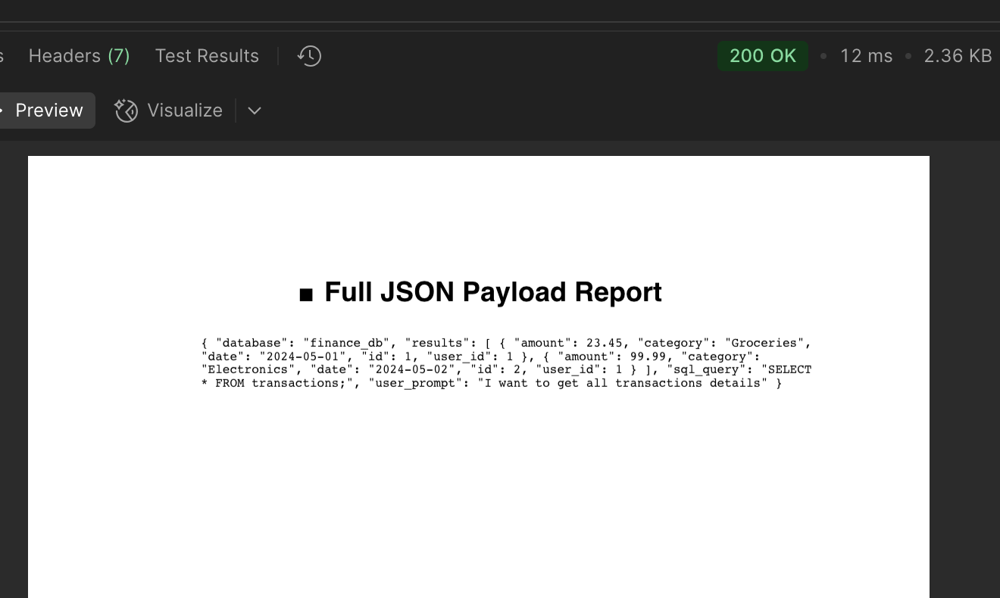
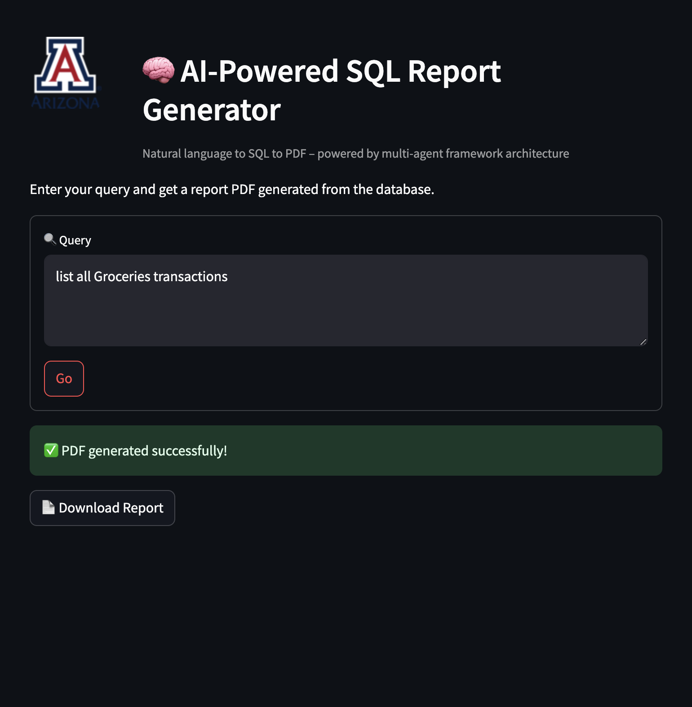

# Multi-Purpose AI Agent Framework

[](https://www.gnu.org/licenses/gpl-3.0)

## A compendium of code, data, and author's manuscript accompanying the manuscript:

#### Multi-Purpose AI Agent Framework: A Versatile Approach for Agent-Orchestrated Collaboration

---

## Overview
This repository is structured as a **reproducible research compendium** for the **Multi-Purpose AI Agent Framework**.  
It includes the complete implementation, experimental results, and supporting materials.  
Future updates will feature **Dockerized execution** and a **Binder container** for easy deployment and reproducibility.

---

## File Organization

📂 Multi-Purpose-AI-Agent-Framework/
│
├── 📁 analysis/  
│   ├── 📁 logs/  
│   │   └── log.md           # Logs of progress, changes, and observations  
│   ├── 📁 images/            
│   ├── 📁 data/  
│   │   ├── 📁 rawData/      # Raw datasets sourced externally  
│   │   └── 📁 derivedData/  # Processed data generated from scripts  
│   └── 📁 supplementaryMaterials/  
│       ├── 📁 supplementaryFigures/  # Additional figures for the paper  
│       └── 📁 supplementaryTables/   # Supporting tables  
│
├── 📁 src/                  # Source code for the framework  
│   ├── backend/             # Flask/FastAPI Boot backend code             
│   ├── agents/             
│
├── 📁 docs/                 # Documentation, research papers, UML diagrams  
│
├── 📁 tests/                # Test cases and validation scripts  
│
├── 📄 README.md             # Main project documentation  
├── 📄 requirements.txt      # Dependencies (if using Python)  
├── 📄 package.json          # Dependencies (if using JavaScript/Node.js)  
├── 📄 Dockerfile            # Containerization setup  
├── 📄 .gitignore            # Ignoring unnecessary files  


## Component Interaction Diagrams


## High Level System Architecture


cd Multi-Purpose-AI-Agent-Framework
1.
Install dependencies:
2. 🛳️ Clone the Repository

cd IoA
3. 🏗️ Build Docker Images
Core Components
You can directly pull the pre-built docker images from docker hub:
   docker build -f OpenAi.Dockerfile -t ksprudhvi/openai-agent:latest .

```bash
docker network create multiagent-net

```
# Client

```bash
docker pull ksprudhvi/multi-purpose-ai-client:latest


docker run -d \
  --name multi-purpose-ai-client \
  --network multiagent-net \
  -p 7788:7788 \
  ksprudhvi/multi-purpose-ai-client:latest
```
# Server
```bash
docker pull ksprudhvi/multi-purpose-ai-server:latest

docker run -d \
--name multi-purpose-ai-server \
--network multiagent-net \
-p 5055:5055 \
ksprudhvi/multi-purpose-ai-server:latest

```
## OpenAiClient


```bash
docker pull ksprudhvi/multi-purpose-ai-openai:latest

docker run -d \
  --name multi-purpose-ai-openai \
  --network multiagent-net \
  -p 7072:7072 \
  ksprudhvi/multi-purpose-ai-openai:latest

```
## Pdf Generation Client

```bash
docker pull ksprudhvi/multi-purpose-ai-pdfagent:latest

docker run -d \
  --name multi-purpose-ai-pdfagent \
  --network multiagent-net \
  -p 7071:7071 \
  ksprudhvi/multi-purpose-ai-pdfagent:latest

```

## SQL Agent  Generation Client

```bash
docker pull ksprudhvi/multi-purpose-ai-sqlliteagent:latest

docker run -d \
  --name multi-purpose-ai-sqlliteagent \
  --network multiagent-net \
  -p 7070:7070 \
  ksprudhvi/multi-purpose-ai-sqlliteagent:latest


```

## Task Intrepreter Generation Client

```bash
docker pull ksprudhvi/multi-purpose-ai-intrepreter:latest

docker run -d \
  --name multi-purpose-ai-intrepreter \
  --network multiagent-net \
  -p 7073:7073 \
  ksprudhvi/multi-purpose-ai-intrepreter:latest


```


# Launch Milvus Service 
# update the code to use local milvus else no run
```bash
docker-compose -f dockerfiles/compose/milvus.yaml up
```
to test in postman/ Post Request  which will download a pdf 
```bash

    "http://127.0.0.1:5050/launch_goal",
    json={
        "goal": I want to get all transactions details,
        "max_turns": 3,
    },


```
## Component Interaction Diagrams

---
or in Ui 

```bash
cd UI
streamlit run streamlit_app.py
```
#Queries related to data base financial data . two table Transactions ,Users 


---
## Authors & Contributions
Prudhvi Kandregula @ksomeswara ,Vamshi Krishnam @vkrishna - System Architecture, Backend, API Design,AI Agent Development, Frontend, Database Management
## Mentor 
Dr .tyson swetnam @tyson-swetnam
